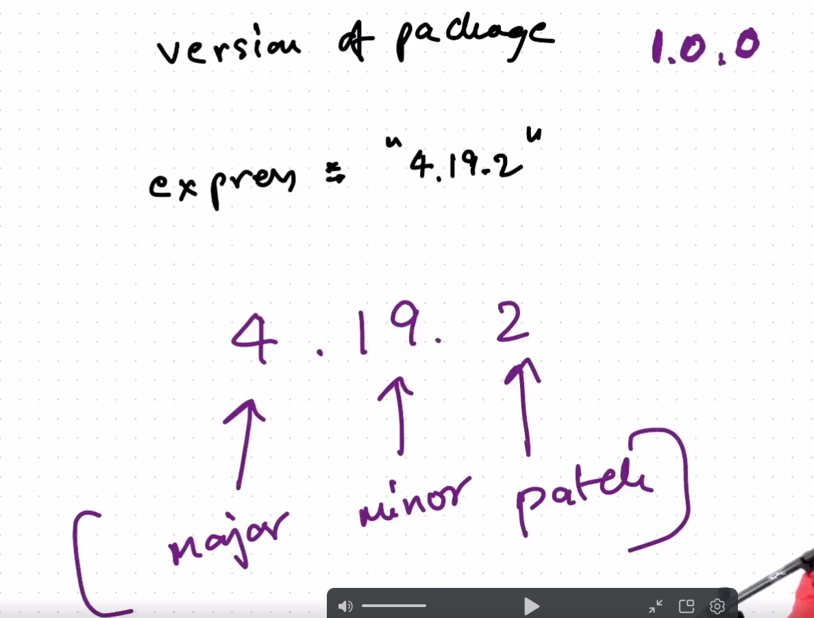
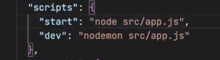

press (Ctrl+`) to open terminal

- https://expressjs.com/ use this link 

- npm init

- install nodemon by "npm i -g nodemon"
   it will automatically refresh the server when we changethe code

   - go to package.json write "dev":"nodemon src/app.js" in "script"
   "start":"node src/app.js"

   the difference between nodemon and node that nodemon automatically refresh the page after we make change in code,which is not done by node

   #Homework 
   - Create a repository
   - Initialize te repository
   - node_modules,package.json, package-lock.json
   - Install express
   - Create a server
   - Listen to port 7777
   - Write request handlers for /test , /hello
   - Install nodemon and update scripts inside package.json
   - What are dependencies
   - What is the use of "-g" while npm install 
   - Difference between caret snd tilde (^ vs `)

   - if you bychance deleted node_modules then you can recreate by typing npm install in terminal

   - if you want to ignore some big files you can write that file name  in
    .gitignore file they will be ignored by github
    

    - if you edite in vscode the code of express then to get the changed output in server you need to recreate the server means again type node index.js or any of your file name or install nodemon ,npm i -g nodemon, if you have time youmay read docs of nodemon

    -

    # homework

     - initialize git
     - gitignore
     - Create a remote repo on github
     - Push all code to remote origin
     - Play with routes and route extensions ex. /hello, / , hello/2 , /xyz
     - Order of the routes matter a lot
     - Install Postman app and make a workspace/collection > test API call
     - Write logic to handle GET , POST , PATCH, DELETE API calls and test them on postman