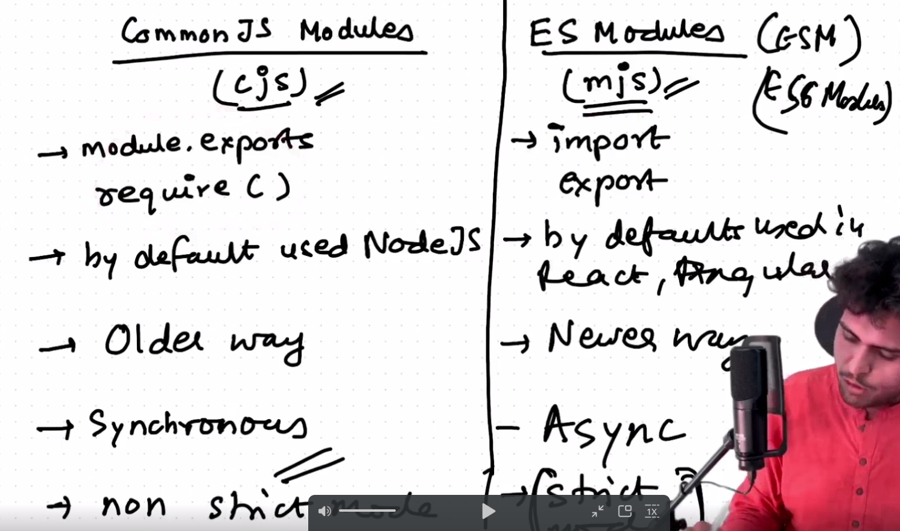

# There are multiplefiles in our project then how can we get code from one file to another 
- like for example you have the javascript code in xyz.js
- so code xyz.js how it execute because node app.js just run perticular app.js file
- we do this by require function

  
as shown CalculateSum(a,b) function does not work

- this module.export and require functions are common js modules(cjs)

